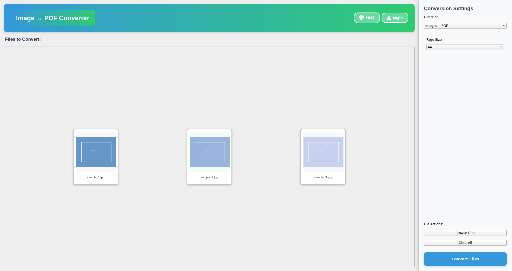

# Image ↔ PDF Converter

A professional, privacy-focused desktop application for bidirectional conversion between images and PDF documents. All conversions happen locally on your machine. Your files never leave your computer.



## Key Features

- **Privacy-First:** 100% local processing. No cloud uploads. 
- **Automatic Metadata Stripping:** Automatically removes EXIF/metadata from images to protect your privacy.
- **Bidirectional Conversion:** 
  - Convert multiple images (JPG, PNG, TIFF, BMP, WebP) into a single PDF.
  - Extract pages from PDF documents as high-quality images.
- **Thumbnail Grid UI:** Visual preview of files with drag-and-drop reordering.
- **Selective Extraction:** Extract specific pages or ranges (e.g., 1, 3, 5-8) from PDFs.
- **Custom Page Sizes:** Support for A4, Letter, Legal, and precise custom dimensions.
- **Local REST API:** Programmatic access for local automation via a localhost API.
- **Cross-Platform:** Available for Windows, macOS, and Linux (including Raspberry Pi).

## Installation

### Downloads
Download the latest binaries for your platform from the [Releases](https://github.com/viyer-1/imagepdf/releases) page.

### Running from Source

1. **Clone the repository:**
   ```bash
   git clone https://github.com/viyer-1/imagepdf.git
   cd imagepdf/desktop-app
   ```

2. **Install dependencies:**
   ```bash
   pip install -r requirements.txt
   ```

3. **Run the application:**
   ```bash
   python src/main.py
   ```

## Development

### Prerequisites
- Python 3.8+
- PyQt6
- Pillow
- ReportLab
- PyMuPDF (fitz)

### Linting & Testing
We use `ruff` for linting and `pytest` for testing.
```bash
cd desktop-app
ruff check src/
pytest tests/
```

## Local REST API
The application includes a local REST API that runs on `localhost:5050`. This allows you to automate conversions from your own scripts or pipelines while maintaining complete privacy.

See [desktop-app/src/api/README.md](desktop-app/src/api/README.md) for detailed documentation.

## License
This project is released under the **MIT License**. See [LICENSE](LICENSE) for details.

## Credits
Built with PyQt6, Pillow, ReportLab, and PyMuPDF.
Developed as a privacy-focused alternative to cloud-based conversion tools.
